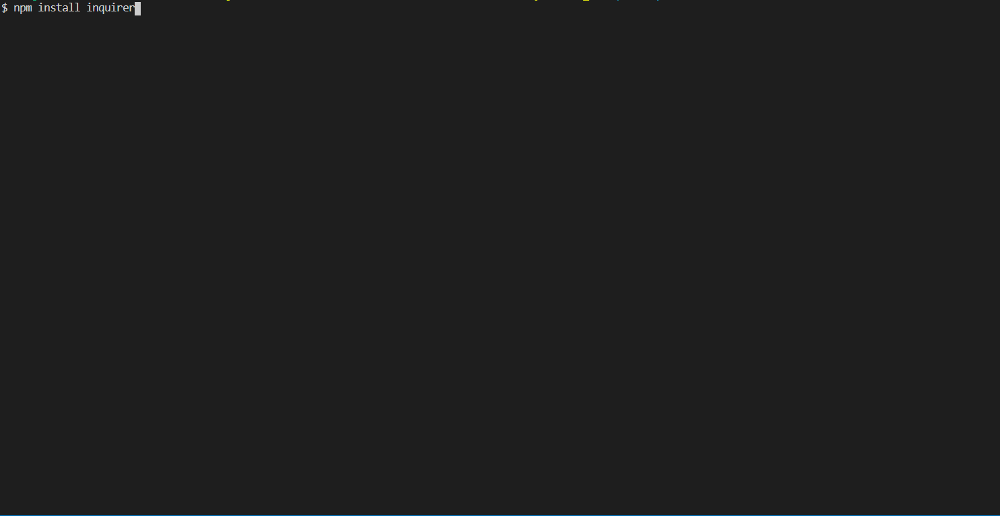
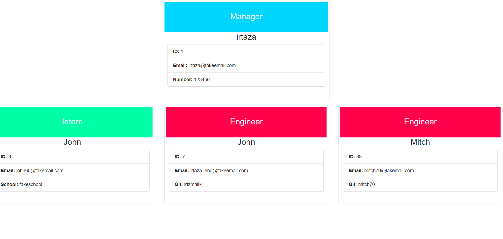
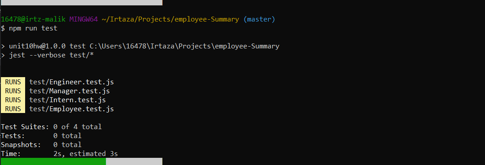
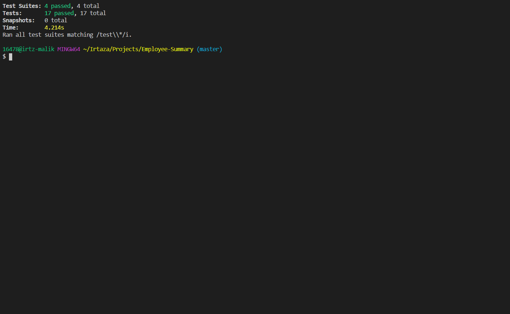

# Employee-Summary
This is an Employee summary app. in which you input the the data of manages, engineer & intern as needed and an output of an html is generated.

## Installation
Git clone the repo on your local computer and run cli.js in Git bash shell

## Usage 
Go to open Bash 

Do NPM Install & press enter

Do npm install inquirer & press enter 

Write app.js, press enter & write details

Choose Members

Enter detail of choosen member

Choose again 

Enter details

Keep entering or get results

Result

For Test write npm run test on terminal

Get test Result

